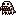

# Digital Compiler     

## Descripción:

**Digital Compiler** es un proyecto compilador basado 
en un lenguaje temático inspirado en **Digimon**, 
diseñado para interpretar programas escritos en un 
lenguaje personalizado llamado **Digital**. 
Este compilador está construido con **ANTLR4** y **Java**, 
y tiene como objetivo enseñar conceptos de compiladores 
mediante una temática creativa.

El lenguaje **Digital** permite definir variables, ejecutar bucles, realizar operaciones matemáticas, imprimir valores en consola y tomar decisiones condicionales, todo con una sintaxis temática relacionada con el universo de Digimon.

---

## Funcionalidades Principales

### 1. **Declaración de variables** 
- **Palabra clave**: `digital`
- **Descripción**: Se ocupa para crear variables en el entorno digimon.
- **Importante !**: Toda variable debe tener el subfijo "mon" o **no funcionarán**.
- **Ejemplo**:
  ```text
  digital agumon;
  digital textomon;
  digital numeromon;
  digital floatmon;

### 1. **Asignación de variables** 
- **Palabra clave**: `=`
- **Descripción**: Se ocupa para asignarle un valor a alguna variable digital, para asignar [Strings] se deben capturar los carácteres entre comillas ' " '.
- **Ejemplo**:
  ```text
  agumon = "Soy un agumon";
  textomon = "Soy un textomon";
  numeromon = 9;
  floatmon = 5.1;

### 3. **Condicionales**  -> 
- **Palabras clave**: `digivolution_if, digivolution_else`
- **Descripción**: Se ocupan para crear condicionales, que ejecutan código dependiendo de la condición.
- **Ejemplo**:
  ```text
  digivolution_if (numeromon > 5) {
    digitalk "numeromon digievoluciona a numeromasgrandemon!";
  } digivolution_else {
  digitalk "numeromon no está listo para digievolucionar.";
  }

### 4. **Ciclos**    
- **Palabra clave**: `training `
- **Descripción**: Se ocupa para repetir un codigo hasta que se cumpla la condición.
- **Ejemplo**:
  ```text
  training (numeromon < 100) {
    numeromon = numeromon + 10;
  }

- **Palabra clave**: `fight (X)`
- **Descripción**: Se ocupa para repetir un codigo "X" cantidad de veces.
- **Ejemplo**:
  ```text
  fight (5) {
    digitalk "Ataque especial de Agumon!";
  }

### 5. **Impresión**    
- **Palabra clave**: `digitalk `
- **Descripción**: Se ocupa para mostrar texo en pantalla.
- **Ejemplo**:
  ```text
  digitalk "¡Hola, Digimundo!";

### 6. **Operaciones Matemáticas y Lógicas** 
- **Aritméticas**: `+, -, *, /, % `
- **Comparaciones**: `>, <, >=, <=, ==, != `
- **Lógicas**: `&&, ||, ! `

---
## Ejemplo de Programa en Digital:

    digimon aventuramon {
      digital puedeEvolucionarmon;
      digital agumon;
      digital powermon;
      

      agumon = true;
      powermon = 0;
      puedeEvolucionarmon = false;

      training (powermon < 30) {
          digitalk "Entrenando a agumon ";
          powermon = powermon + 10;

          digivolution_if (powermon > 20) {
                digitalk "Agumon esta listo para digievolucionar a Greymon!";
                puedeEvolucionarmon = true;
            } digivolution_else {
                digitalk "Entrenamiento necesario para digievolucionar.";
            }
      }

      digitalk "Poder actual de Agumon: " ;
      digitalk powermon;

      digivolution_if (puedeEvolucionarmon && agumon) {
            digitalk "Agumon digievoluciona a Greymon! ";
        } digivolution_else {
            digitalk "Agumon no puede digievolucionar.";
        }
    }
---
## Diseño del Lenguaje 

### Gramática:
El lenguaje está definido en el archivo Digital.g4, que describe las reglas de sintaxis. A continuación, se describen los componentes clave:

### Reglas léxicas (tokens):

Palabras clave como digital, digitalk, digivolution_if, training.
Identificadores que terminan con "mon".
Operadores matemáticos y lógicos (+, *, >, etc.).

### Reglas sintácticas:

La estructura principal es un programa delimitado por {}.
Soporta bloques condicionales, ciclos, y expresiones matemáticas.

### Tecnologías Utilizadas:
- ANTLR4: Generador de analizadores léxicos y sintácticos.
- Java: Lenguaje principal para implementar el intérprete.
- Estructura AST (Abstract Syntax Tree): Representación interna del programa para su ejecución.

---
## Instalación y Uso 
### Requisitos previos:

- JDK 11 o superior.
- ANTLR4.

### 1. Ejecutar el main:
primero se necesita ejecutar el archivo "Main.java" (`src/main/java/com/fundamentos/cs/interprete/Main.java`) utilizando el IDE de preferencia.

### 2. Seleccionar archivo utilizando el Interfaz:

Selecionar el botón de "Abrir archivo" e ingresar cualquier archivo de formato ".digimon", luego la consola mostrara el resultado del archivo compilado y ejecutado.


## 


